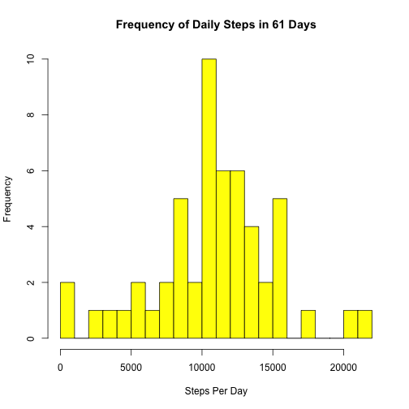
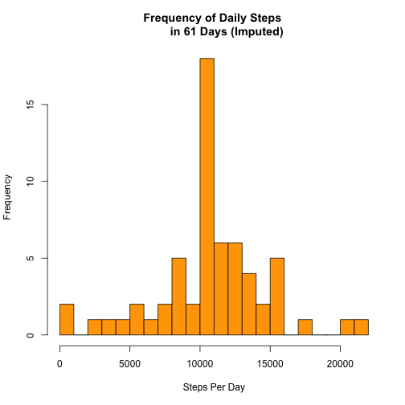

#### Personal Activity Report

Data used for this report were collected from an anonymous individual during the months of October and November, 2012 using personal activity monitoring device. This device records data at 5 minute intervals through out the day for 61 days. 

#### Load data and initial exploratory data analysis


```r
#read in data
url="https://d396qusza40orc.cloudfront.net/repdata%2Fdata%2Factivity.zip"
download.file(url, destfile = "/Users/zhihuang/desktop/Project1/activity.zip", method="curl")
data <- read.csv(unzip("/Users/zhihuang/desktop/Project1/activity.zip"))
# convert date to Date class
data$date <- as.Date(data$date, format = "%Y-%m-%d") 
str(data)
```

```
## 'data.frame':	17568 obs. of  3 variables:
##  $ steps   : int  NA NA NA NA NA NA NA NA NA NA ...
##  $ date    : Date, format: "2012-10-01" "2012-10-01" ...
##  $ interval: int  0 5 10 15 20 25 30 35 40 45 ...
```

#### Extimate the mean total number of steps taken per day?

1. Make a histogram of the total number of steps taken each day
2. Calculate the mean and median total number of steps taken per day  


```r
require("plyr")
data2 <- na.omit(data)
sum<- ddply(data2, .(date), summarize, sum.steps = sum(steps))
hist(sum$sum.steps, breaks=20, col="yellow", main="Frequency of Daily Steps in 61 Days", 
        xlab="Steps Per Day")
```

 


```r
mean(sum$sum.steps)
```

```
## [1] 10766.19
```

```r
median(sum$sum.steps)
```

```
## [1] 10765
```
The mean total number of steps taken each day is 10766.19, the median is 10765.

#### Average daily activity pattern

1. Make a time series plot (i.e. type = "l") of the 5-minute interval (x-axis) 
and the average number of steps taken, averaged across all days (y-axis)  
2. Which 5-minute interval, on average across all the days in the dataset,
contains the maximum number of steps?  

```r
mean<- ddply(data2, .(interval), summarize, mean.steps = mean(steps, na.rm = TRUE))
plot(mean$interval, mean$mean.steps, type='l', col=1, 
        main="Average number of steps averaged over all days", 
        xlab="Interval (5-min)", ylab="Average number of steps")
```

 


```r
maxsteps<- which.max(mean$mean.steps)
mean[maxsteps, ]
```

```
##     interval mean.steps
## 104      835   206.1698
```

The 835th 5-min interval,on average across all the days in the dataset, contains the max number of steps.

#### Imputing missing values

Note that there are a number of days/intervals where there are missing values (coded as NA). The presence of missing days may introduce bias into some calculations or summaries of the data.

* *Estimate the total number of missing values in the dataset.*  


```r
# get rows with NA's
data.NA <- data[!complete.cases(data),]
# number of rows with NA's
nrow(data.NA)
```

```
## [1] 2304
```
There are 2304 missing values in the data set.

* *Filling in all of the missing values in the dataset.*   

Missing values (NAs) are replaced using the mean of that 5-min interval set that was calculated in the last section (data frame "mean"). Detailed steps are described in next section.  

* *Create a new dataset that is equal to the original dataset but with the missing data filled in.*    


```r
# imputation of NAs
for (i in 1:nrow(data)){
        if (is.na(data$steps[i])){ #search rows with NAs in df 'data'
                interval.value <- data$interval[i] #identify coresponding interval value
                row.id <- which(mean$interval == interval.value) 
                steps.value <- mean$mean.steps[row.id] # identify mean step value in df 'mean'
                data$steps[i] <- steps.value #replace NAs
        }
}
```

* *Make a histogram of the total number of steps taken each day and calculate the mean and median total number of steps taken per day.*         


```r
#histogram of total steps per day
sumImputed <- ddply(data, .(date), summarize, sumImputed.steps = sum(steps, na.rm = TRUE))
hist(sumImputed$sumImputed.steps, breaks=20, col="orange", main="Frequency of Daily Steps 
        in 61 Days (Imputed)", xlab="Steps Per Day")
```

 

```r
#calculate new mean and median
mean(sumImputed$sumImputed.steps)
```

```
## [1] 10766.19
```

```r
median(sumImputed$sumImputed.steps)
```

```
## [1] 10766.19
```
The mean total number of steps taken each day from NA replaced data frame is 10766.19 and the median is 10766.19.

* *Do these values differ from the estimates from the first part of the assignment?*

Mean values are the same; median value slightly increases compared with the estimation from the the previous section.  

* *What is the impact of imputing missing data on the estimates of the total daily number of steps?*

Filling in the NAs with the corresponding interval means results in increasing the frequencies of steps values per day at about 10000 and moving median to the mean.    

#### Activity patterns between weekdays and weekends

Use the dataset with the filled-in missing values:

1. Create a new factor variable in the dataset with two levels – “weekday” and “weekend” indicating whether a given date is a weekday or weekend day.  
2. Make a panel plot containing a time series plot (i.e. type = "l") of the 5-minute interval (x-axis) and the average number of steps taken, averaged across all weekday days or weekend days (y-axis).


```r
# add a new column as day of the week 
data$day <- weekdays(data$date)
# add a new column showing day type: weekday or weekend
data$day.type <- c("weekday")
# make Saturday or Sunday as weekend
for (i in 1:nrow(data)){
        if (data$day[i] == "Saturday" || data$day[i] == "Sunday"){
                data$day.type[i] <- "weekend"
        }
}
# convert day type to factor
data$day.type <- as.factor(data$day.type)
```


```r
# calculate the average number of steps taken, averaged across all weekday days or weekend days 
meanImputed.daytype <- ddply(data, .(interval, day.type), summarize, 
                            meanImputed.daytype.steps = mean(steps))
# plot for activity on the weekdays and weekends
library(lattice)
xyplot(meanImputed.daytype.steps ~ interval | day.type, meanImputed.daytype, type = "l", 
       layout = c(1, 2), xlab = "Interval", ylab = "Number of steps")
```

 


